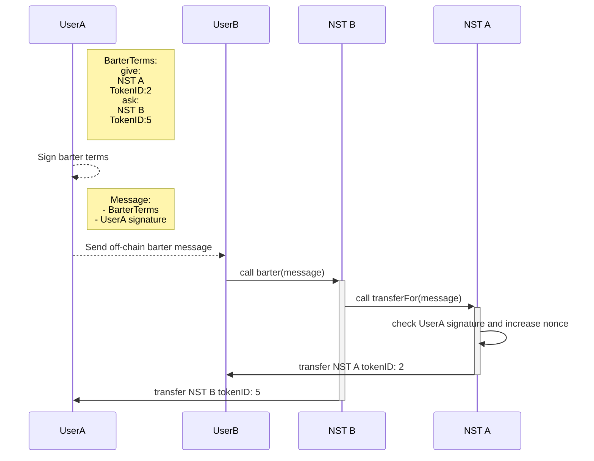

## Abstract

This EIP is an extensions of [EIP-712](https://github.com/ethereum/EIPs/blob/master/EIPS/eip-721.md) to create non-sellable tokens (NST). It proposes a strong resriction on transfers in order to prevent speculation on token price while maintaining the possibility of transfers, transfers are performed in a barter way (send to receive or receive to send).

## Motivation

Interest for soulbound tokens (SBT) in the Ethereum community still growing since the V. Buterin [idea publication](https://vitalik.ca/general/2022/01/26/soulbound.html), highlighting the non-transferrability (non-)features to prevent, _in fine_, speculation of the token. While a lot of propositions emerged for implementation of SBT, the non-transferability is often too restrictive and requires a certain level of centralization, especially when users want to transfer a SBT between two owned accounts. Thus SBTs are way more fitted for account-bounded properties such as reputation, voting rights, privileges, ...

In case of transferable items which cannot be sellable (such as game items, gifts, discounts, ...), SBTs can fit but they require strong level of centralization as transfer are restricted by the token creator (or the community in case of DAO managed SBT).

NSTs propose a way to enforce users to perform barter of tokens between two authorized tokens in order to maintain a value equivalence in the exchange and so reduce the risk of speculation associated with an one way transfer. NSTs would provide a solution for transferring non-valuable tokens between projects based on their true value instead of their perceived/ speculated value without leveraging a third party.

## Specification

The key words "MUST", "MUST NOT", "REQUIRED", "SHALL", "SHALL NOT", "SHOULD", "SHOULD NOT", "RECOMMENDED", "NOT RECOMMENDED", "MAY", and "OPTIONAL" in this document are to be interpreted as described in RFC 2119 and RFC 8174.

### Overview

An approval mecanism is REQUIRED before performing barters between two token, belonging to the same or different NST contract (see [Permissonless barter](#permissionless-barter)).

Every contract compliant with this EIP MUST implement this transfer mecanism:

1. UserA sign a message taking up the terms of the barter
2. UserB accepts and concludes the barter by calling the `barter` function



### NST

#### Methods

In the following the `BarterTerms` struct is defined as follows:

```solidity
struct BarterTerms {
    Componant bid;
    Componant ask;
    Message message;
}

struct Componant {
    address tokenAddr;
    uint256 tokenId;
}

struct Message {
    address owner;
    uint256 nonce;
}
```

See [Define the barter terms](#define-the-barter-terms) section for precisions on this struct.

##### transferFor

Verify signature following the [EIP-712](https://github.com/ethereum/EIPs/blob/master/EIPS/eip-712.md) procedure, increase the nonce of `data.message.owner` and transfers the `data.bid.tokenId` to `to` account.

This function MUST be called only by authorized NST contract, the call MUST occurs when users calling the `barter` function.

NOTE: using [ECDSA.sol](https://github.com/OpenZeppelin/openzeppelin-contracts/blob/master/contracts/utils/cryptography/ECDSA.sol) (`v4.7.3` at least) and [EIP712.sol](https://github.com/OpenZeppelin/openzeppelin-contracts/blob/master/contracts/utils/cryptography/EIP712.sol) library from OpenZeppelin is very RECOMMANDED for signature verifications, verification only based on `ecrecover` SHOULD NOT be used.

```solidity
function transferFor(BarterTerms memory data, address to, bytes memory signature) external;
```

##### barter

Calls the `transferFor` function on the `data.bid.tokenAddr`, MAY be self, and transfers `data.bid.tokenId` to `data.message.owner`

This function MUST check if `data.bid.tokenAddr` is an authorized contract before calling `transferFor`

```solidity
function barter(BarterTerms memory data, bytes memory signature) external;
```

##### nonce

Returns successful barter concluded as bidder/proposer.

This value MUST be included in the barter terms signed message to prevents a signature from being used multiple times.

```solidity
function nonce(address account) external view returns (uint256);
```

##### isBarterable

OPTIONAL - Returns `true` is the `tokenAddr` is authorized to perform barter.

```solidity
function isBarterable(address tokenAddr) external view returns (bool);
```

#### Events

##### BarterNetworkUpdated

MUST trigger when NST contract address is authorized or revoked.

```solidity
event BarterNetworkUpdated(address indexed tokenAddr, bool indexed barterable);
```

### Define the barter terms

Barter terms are represented as the `barter` function's arguments and MUST:

- be signed following the [EIP-712](https://github.com/ethereum/EIPs/blob/master/EIPS/eip-712.md) procedure
- be shared equally between NSTs
- include for each tokens:
  - contract address
  - token ID
- include for the signer:
  - address of the signer
  - a nonce to prevent signature reuse

Barter terms MAY be represented as nested struct as follows:

```solidity
struct BarterTerms {
    Componant bid;
    Componant ask;
    Message message;
}

struct Componant {
    address tokenAddr;
    uint256 tokenId;
}

struct Message {
    address owner;
    uint256 nonce;
}
```

Barters MAY be declined into several types, if any, `barter` and `transferFor` MUST leverage Solidity's [functions overloading](https://docs.soliditylang.org/en/latest/contracts.html#function-overloading) to implement the specific logic for each barter type. See following exemple:

```solidity
{...}
struct MultiBarterTerms {
    MultiComponant bid;
    MultiComponant ask;
    Message message;
}

struct MultiComponant {
    address tokenAddr;
    uint256[] tokenIds;
}

function barter(BarterTerms memory data, bytes memory signature) external;
function barter(MultiBarterTerms memory data, bytes memory signature) external;
```

### Contract interface

Every contracts compliant with this EIP MUST implement [ERC721](https://github.com/ethereum/EIPs/blob/master/EIPS/eip-721.md) where following methods MUST be disabled:

- `safeTransferFrom(address,address,uint256,bytes)` (`0xb88d4fde`)
- `safeTransferFrom(address,address,uint256)` (`0x42842e0e`)
- `transferFrom(address,address,uint256)` (`0x23b872dd`)

#### [ERC165](https://github.com/ethereum/EIPs/blob/master/EIPS/eip-165.md) compliance

NST contracts SHALL implement the `ERC165` interface as specified in the [ERC721](https://github.com/ethereum/EIPs/blob/master/EIPS/eip-721.md).

_This section need more informatons or be removed_

## Rationale

This EIP has been designed to leverage existant features of the [ERC721]() such as `approve/allowance` and `Transfer` events and leave the full control on the implementation.

Research paths explorer to solve NST and propose this EIP

### Permissionless barter

Tokens created compliant with this EIP MUST design authorizations between tokens on both `barter` and `transferFor` function to keep the non-sellability of tokens. We explored cases of permissionless or one-way perssionless barter, in both case it open the possibility of bypassed one-way transfer.

#### Fully permissionless

Allowing any barter type between NSTs make no such sense to prevent the non-sellability of the token. Any smart contract could bypass this kind of transfer by creating a valueless NST to barter with others. In this case replacing transfers functions would be useless.

The value equivalence is so maintained by tokens creators as a whitelist, keeping these authorisations at the contract level is important and would help create a network of barterable NST.

Based on value equivalence we leverage the game theory to enforce the non-sellability instead of stronger restrictions or centralization which would lead to higher code complexity and poor interoperability. Indeed the strong couterparty at the transfer made NSTs highly illiquid to be subject to a sale on a marketplace or by OTC agreement.

#### One way permissionless

##### On `transferFor`

Leaving this method permissionless would lead to the possibility to self transfer the token to any other address, without implies a barter.

##### On `barter`

Using `barter` without restriction open the risk of unwanted barter between non-equivalent NST. Thus any valueless NST could be used to perform a one-way transfer.

---

WIP 👇

---

### Multi NST contract barter

As the barterable network is set at the contract level, performing a barter implies to have signature of the both part and verify one signature for on token.

### Register of allowed NST

Managed by a DAO, NST network better...

### Third party protocol

Implement as a protocol for NFT swap like [Sudoswap](https://otc.sudoswap.xyz/#/create), still have EIP721 properties.

### "Barter" word choice

see [NFT word choice](https://github.com/ethereum/EIPs/blob/master/EIPS/eip-721.md#rationale)

### "NST" word choice

### Work from a minimal ERC721 interface

This still allow to rely on `Transfer` event and `allowances` features and maintaining a fully backward compability.

## Backwards Compatibility

This proposal is fully backward compatible with [EIP-721](https://github.com/ethereum/EIPs/blob/master/EIPS/eip-721.md)

## Test Cases

(Link to reference implementation test suite.) Written using Foundry

## Reference Implementation

Link to the minimal implementation contracts (can be the same as Test Cast)

## Security Considerations

Front runnning attack when not specifying the tokenID (must be included in rational?)

Or leave:

Needs discussion.

## Copyright

Copyright and related rights waived via [CC0](../LICENSE.md).
